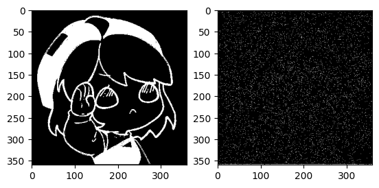

# Langevin Dynamics 

work based on https://github.com/enhuiz/langevin-dynamics-and-score-matching

### Setup

```bash
pip install -r requirements.txt
```

### Gooooo

```bash
python main.py config/xingtong.yml
```

### Demo 

